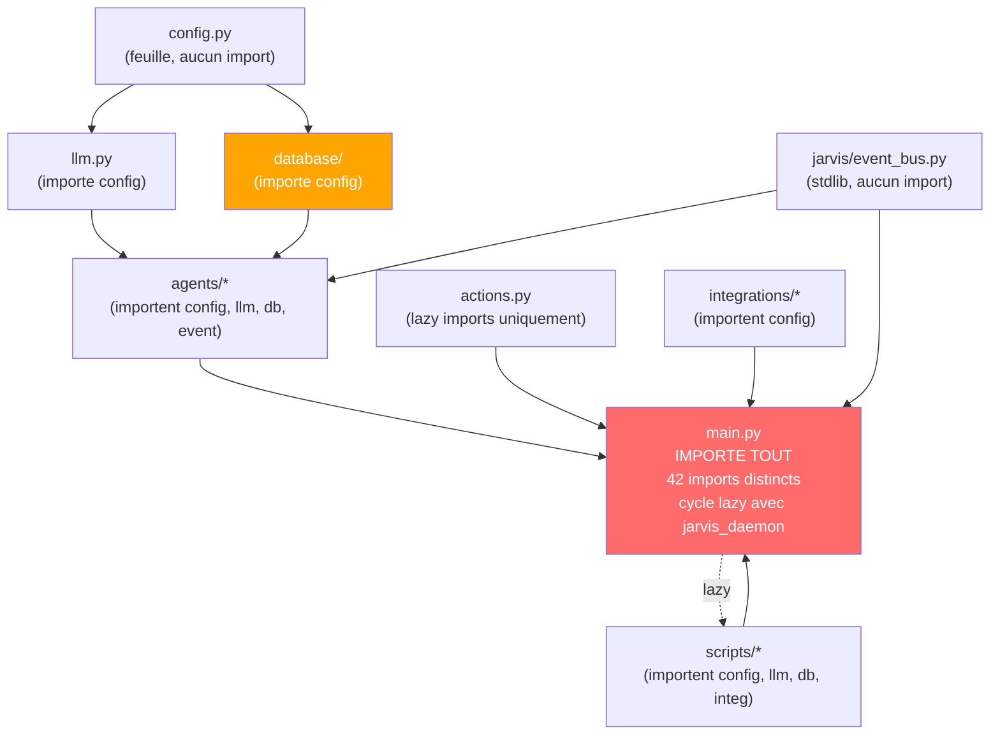
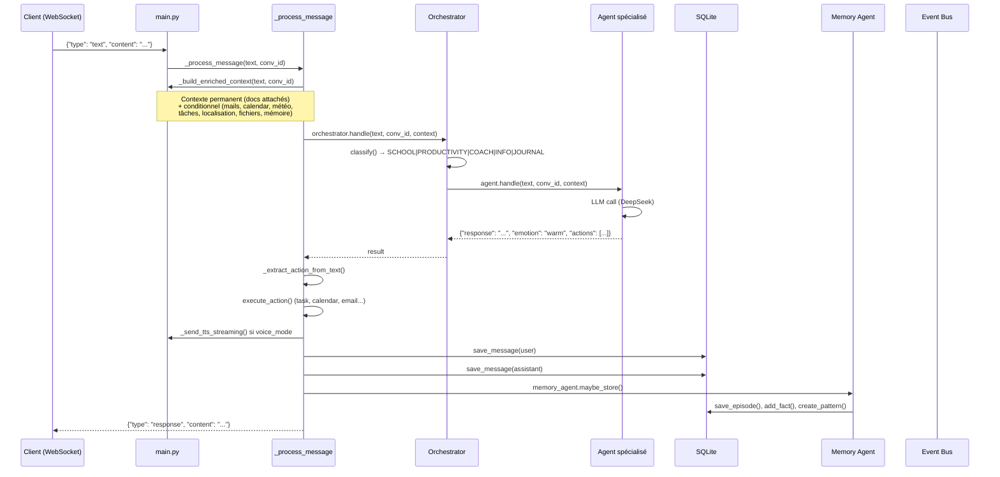
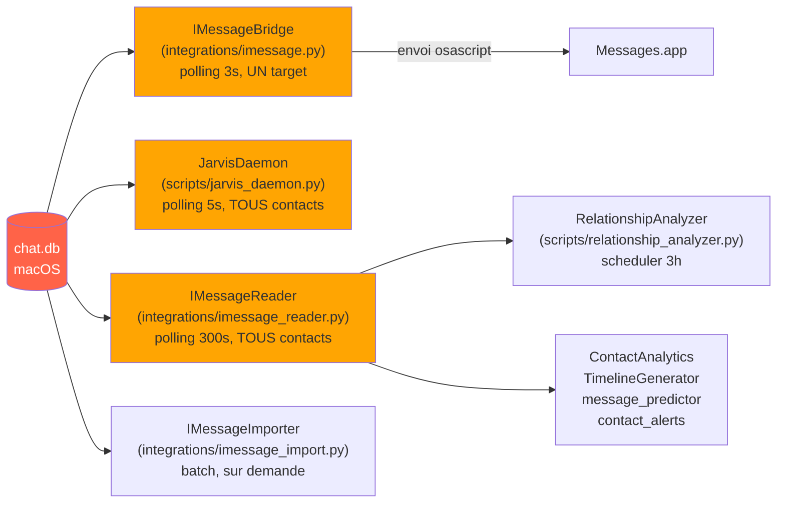
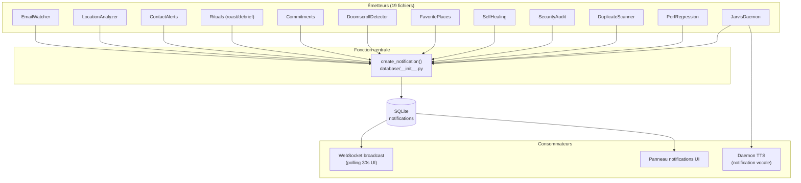
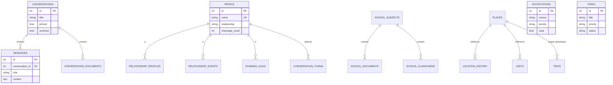

# 01 — Cartographie Complète

**Date** : 11 juillet 2026

---

## 1. Structure du dépôt

```
JarvisAPI/
├── main.py                    ← Point d'entrée FastAPI (7194 lignes, monolithe)
├── supervisor.py              ← Processus 24/7 (port 9000, sert le frontend)
├── config.py                  ← Configuration centralisée (.env → settings)
├── llm.py                     ← Client DeepSeek API (chat, stream, classify)
├── actions.py                 ← Exécution des blocs ```action``` (1014 lignes)
├── auth.py                    ← Authentification (scrypt, sessions, anti-brute-force)
├── push.py                    ← Web Push (VAPID, aes128gcm)
├── pipeline.py                ← (créé en Phase 1) Pipeline _process_message
│
├── agents/                    ← 7 agents LLM + orchestrateur
│   ├── __init__.py            ← BaseAgent + registry (526 lignes)
│   ├── orchestrator.py        ← Classifieur + dispatcher (744 lignes)
│   ├── coach.py               ← Life coach
│   ├── info.py                ← Météo, recherche web
│   ├── journal.py             ← Extraction insights
│   ├── memory.py              ← Mémoire transversale (449 lignes)
│   ├── productivity.py        ← Email, calendrier, tâches
│   ├── school.py              ← Cours, fiches, flashcards
│   ├── devops.py              ← Agent DevOps
│   ├── autonomous_loop.py     ← Mode autonome /loop
│   ├── display_text.py        ← Formatage affichage (émotions, code fences)
│   ├── easter_eggs.py         ← Easter eggs
│   └── devagent/              ← Développement autonome (interview → code → test)
│
├── database/                  ← SQLite (45 tables)
│   ├── __init__.py            ← CRUD monolithique (4169 lignes, ~208 fonctions)
│   ├── schema.sql             ← Schéma complet
│   ├── location_helpers.py    ← CRUD localisation (déjà extrait)
│   ├── devagent.py            ← CRUD projets dev (déjà extrait)
│   └── migrations/            ← Migrations versionnées
│
├── audio/                     ← STT + TTS + VAD + enregistrement continu
│   ├── stt.py                 ← STT (faster-whisper local + ElevenLabs Scribe)
│   ├── tts.py                 ← TTS (Edge, ElevenLabs, macOS say, Kokoro)
│   ├── tts_cache.py           ← Cache TTS spéculatif
│   └── continuous_recorder.py ← Enregistrement long → transcription
│
├── integrations/               ← Intégrations Apple + externes
│   ├── imessage.py            ← Bridge iMessage (polling chat.db + envoi osascript)
│   ├── imessage_reader.py     ← Lecteur générique chat.db (utilisé par 10+ modules)
│   ├── imessage_import.py     ← Import chat.db → jarvis.db
│   ├── imessage_daemon_client.py ← Client HTTP vers daemon iMessage
│   ├── contacts.py            ← Lecteur Contacts.app (AddressBook SQLite + AppleScript)
│   ├── mail.py                ← Apple Mail via AppleScript
│   ├── calendar_api.py        ← Calendar.app via AppleScript
│   ├── weather.py             ← OpenWeatherMap
│   ├── web_search.py          ← Tavily API
│   ├── computer.py            ← Shell sécurisé + AppleScript
│   ├── code_executor.py       ← Open Interpreter (exécution code avancée)
│   ├── notifications_macos.py ← Notifications bureau macOS
│   └── location.py            ← LocationManager (GPS, visites, trajets)
│
├── scripts/                    ← Workers, scheduler, daemons, maintenance
│   ├── scheduler.py           ← APScheduler (29 jobs)
│   ├── jarvis_daemon.py       ← Daemon sentinelle (écran, TTS, iMessage, calendar)
│   ├── audio_daemon.py        ← Daemon audio (micro, VAD, wake word)
│   ├── email_watcher.py       ← Surveillance email proactive
│   ├── screen_watcher.py      ← Capture écran + diff pixel + Ollama vision
│   ├── imessage_daemon.py     ← Daemon HTTP iMessage (port 8193)
│   ├── imessage_import.py     ← CLI import iMessage
│   ├── relationship_analyzer.py ← Analyse relationnelle DeepSeek
│   ├── contact_analytics.py   ← Métriques relationnelles sans LLM
│   ├── contact_alerts.py      ← Alertes silence / non-répondu
│   ├── timeline_generator.py  ← Timeline événementielle par contact
│   ├── message_predictor.py   ← Prédiction prochain message
│   ├── location_analyzer.py   ← Analyse habitudes géographiques
│   ├── force_full_mac_sync.py ← Sync profonde macOS
│   ├── backfill_imessages.py  ← Rattrapage manuel import
│   ├── sync_contacts.py       ← Sync noms Contacts.app → people
│   ├── rituals.py             ← Roast, debrief, citation
│   ├── commitments.py         ← Promesses traquées
│   ├── presence.py            ← Détection présence au bureau (son)
│   ├── meeting.py             ← Capture réunions (opt-in)
│   ├── day_scoring.py         ← Score journée exceptionnelle
│   ├── doomscroll_detector.py ← Détection doomscrolling
│   ├── procrastination_cost.py← Coût procrastination
│   ├── favorite_places.py     ← Lieux favoris + opportunités manquées
│   ├── jarvis_journal.py      ← Journal tenu par JARVIS
│   ├── relationship_graph.py  ← Graphe vivant des relations
│   ├── time_machine.py        ← Reconstruction chronologique journée
│   ├── semantic_search.py     ← Recherche sémantique (embeddings locaux)
│   ├── self_healing.py        ← Diagnostic + patch réversible
│   ├── db_migrations.py       ← Gestionnaire de migrations
│   ├── duplicate_scanner.py   ← Scan code dupliqué
│   ├── security_audit.py      ← Audit sécurité
│   ├── test_coverage_scan.py  ← Scan couverture tests
│   ├── local_ci.py            ← CI locale
│   ├── perf_regression.py     ← Détection régression perf
│   ├── db_maintenance.py      ← Backup, purge, chiffrement
│   ├── imessage_sync_health_check.py ← Check santé sync
│   ├── test_macos_permissions.py ← Test permissions TCC
│   ├── install_git_hooks.py   ← Installation hooks git
│   └── jarvis_agent.py        ← Agent distant MacBook
│
├── jarvis/                     ← Package Dual-LLM privacy
│   ├── event_bus.py           ← Event bus (usage minimal : 1 abonné debug)
│   ├── message_intelligence.py← Intelligence messages
│   └── ...
│
├── web/                        ← SPA desktop (React 19 + Vite)
│   ├── src/
│   │   ├── app/
│   │   │   ├── App.tsx        ← Routes React Router
│   │   │   └── components/
│   │   │       ├── auth/LockGate.tsx        ← Verrouillage PIN
│   │   │       ├── layout/BigBrotherLayout  ← Layout desktop
│   │   │       ├── views/                   ← 17 vues (Chat, Dashboard, Voice...)
│   │   │       └── pwa/                     ← InstallPrompt, NotificationsPrompt
│   │   ├── services/
│   │   │   ├── api.ts          ← Client REST (~60 méthodes)
│   │   │   └── websocket.ts    ← WebSocket singleton
│   │   ├── lib/
│   │   │   ├── offline/        ← IndexedDB + file d'écriture
│   │   │   └── push.ts         ← Abonnement Web Push
│   │   └── hooks/
│   ├── sw.ts                   ← Service Worker Workbox
│   └── vite.config.ts
│
├── pwa/                        ← PWA mobile (Next.js 14)
│   ├── src/
│   │   ├── app/                ← Pages (dashboard, tasks, mails, map, config)
│   │   ├── components/         ← Composants (BottomNav, TaskList, MapView...)
│   │   └── lib/
│   │       ├── api.ts          ← Wrapper fetch minimaliste (52 lignes)
│   │       ├── geolocation.ts  ← Tracking GPS
│   │       └── briefing-parser.ts ← Parser briefing
│   ├── public/
│   │   ├── sw.js               ← Service Worker next-pwa
│   │   └── manifest.json
│   └── next.config.js
│
├── tv/                         ← Dashboard TV War Room
├── prompts/                    ← System prompts (.txt)
├── tests/                      ← 523 fonctions de test (55 fichiers) pytest
├── data/                       ← jarvis.db, uploads, outputs
└── Architecture/               ← CE RAPPORT
```

---

## 2. Dépendances inter-modules



### Matrice de couplage

| Module | Importé par | Problème |
|---|---|---|
| `config.py` | Tout le monde | OK — feuille, pas de dépendance |
| `llm.py` | Agents, scripts, main | OK |
| `database/__init__.py` | Agents, scripts, main, integrations | God object (4169 lignes, 23 domaines) |
| `jarvis/event_bus.py` | Agents, main | Usage minimal : 1 abonné debug, pas encore de consommateurs métiers |
| `main.py` | supervisor, jarvis_daemon (lazy) | **Monolithe** — 42 imports, 183 routes |
| `agents/orchestrator.py` | main | OK |
| `scripts/jarvis_daemon.py` | main (lazy) | **Cycle** avec main.py |

### Dépendance circulaire

```
main.py ──(lazy import)──▶ scripts/jarvis_daemon.py
    ▲                            │
    │                            │
    └────(lazy import)───────────┘
    _process_message_internal, _process_voice_fast
```

Le cycle est brisé par des imports `lazy` (à l'intérieur des fonctions), donc pas de crash au démarrage. Mais c'est un couplage fort : `main.py` dépend du daemon pour son cycle de vie, et le daemon dépend de fonctions internes de `main.py`.

---

## 3. Flux de données principaux

### 3.1 Pipeline de traitement de message (le plus important)



### 3.2 Flux iMessage (lecture chat.db)



**Problème** : 3 curseurs ROWID indépendants (bridge, daemon, reader) sans coordination. Le bridge et le daemon peuvent traiter le même message.

### 3.3 Flux notifications



**Problème** : 19 émetteurs directs, pas d'event bus. Chaque émetteur duplique sa propre logique de priorité et d'anti-doublon.

---

## 4. Stockage

### 4.1 SQLite — jarvis.db (45 tables)



### 4.2 Tables import iMessage (8 tables)

```
imessage_handles        → handles (téléphone, email)
imessage_chats          → conversations
imessage_chat_handles   → liaison N-N
imessage_messages       → messages bruts (apple_rowid UK, guid UK, content_hash UK)
imessage_attachments    → pièces jointes
imessage_reactions      → tapbacks
imessage_sync_cursor    → curseur d'import (1 ligne, CHECK(id=1))
imessage_analysis_cache → curseur d'analyse par contact
```

### 4.3 Frontend — Stockage local

| Techno | web/ (desktop) | pwa/ (mobile) |
|---|---|---|
| IndexedDB | ✅ (`jarvis-offline` : writeQueue + readCache) | ❌ Aucun |
| Service Worker | ✅ Workbox (precache app shell) | ✅ next-pwa |
| Cache API | ✅ (via Workbox) | ✅ (via next-pwa) |
| Background Sync | ✅ (event `sync`) | ❌ |
| Push Notifications | ✅ (VAPID + aes128gcm) | ❌ |

---

## 5. Réseau et sécurité

### 5.1 Ports et services

```
┌─────────────────────────────────────────────────────┐
│                    Mac (hôte)                        │
├─────────────────────────────────────────────────────┤
│  Port 9000  │ Supervisor (24/7)                     │
│             │ - Sert le frontend (web/dist/)         │
│             │ - Proxy WebSocket vers 8081            │
│             │ - Health-check + auto-restart          │
│  Port 8081  │ Backend FastAPI                       │
│             │ - 183 routes REST                     │
│             │ - WebSocket /ws                       │
│             │ - Sert /m/ (PWA mobile)               │
│  Port 5173  │ Vite Dev Server (dev uniquement)      │
│  Port 5174  │ TV Dashboard                          │
│  Port 8193  │ Daemon HTTP iMessage (optionnel)      │
│  Port 11434 │ Ollama (vision locale, optionnel)     │
├─────────────────────────────────────────────────────┤
│  Fichiers   │ ~/Library/Messages/chat.db (READONLY) │
│             │ ~/Library/Application Support/         │
│             │   AddressBook/ (READONLY)              │
└─────────────────────────────────────────────────────┘
```

### 5.2 Authentification

```
┌──────────────────────────────────────────────────┐
│              Flux d'authentification              │
├──────────────────────────────────────────────────┤
│  1. Setup initial (une seule fois)                │
│     POST /api/auth/setup {"secret": "1234"}       │
│     → hash scrypt, cookie jarvis_session          │
│                                                   │
│  2. Unlock                                       │
│     POST /api/auth/unlock {"secret": "1234"}      │
│     → cookie httpOnly, SameSite=Strict            │
│     → session DB (token hash SHA-256)             │
│                                                   │
│  3. Vérification (chaque requête /api/*)          │
│     → security_middleware                         │
│     → auth.verify_session(cookie)                 │
│     → 428 si pas configuré, 401 si invalide       │
│                                                   │
│  4. Auto-lock (côté client)                      │
│     → LockGate.tsx : inactivité > 5 min           │
│     → POST /api/auth/verify (soft lock)           │
│                                                   │
│  5. Cookie                                        │
│     → jarvis_session                              │
│     → HttpOnly ✓                                  │
│     → SameSite=Strict ✓                           │
│     → Secure (si WEB_HTTPS=true)                  │
│     → Expiration: 30j absolue, 14j inactivité     │
└──────────────────────────────────────────────────┘
```

**Problème** : La PWA mobile (`/m/`) n'a PAS de LockGate. Le cookie est transmis automatiquement (même origine HTTP), donc si un téléphone déverrouillé accède à `/m/`, toutes les données sont exposées.

### 5.3 Permissions macOS requises

| Permission | Composant | Fichier |
|---|---|---|
| Full Disk Access | Lecture chat.db | `integrations/imessage.py`, `integrations/imessage_reader.py`, `integrations/imessage_import.py`, `scripts/jarvis_daemon.py` |
| Automation (Messages.app) | Envoi iMessage | `integrations/imessage.py`, `scripts/jarvis_daemon.py` |
| Automation (Mail.app) | Lecture emails | `integrations/mail.py`, `scripts/email_watcher.py` |
| Automation (Calendar.app) | CRUD calendrier | `integrations/calendar_api.py` |
| Automation (Contacts.app) | Résolution noms | `integrations/contacts.py` |
| Enregistrement d'écran | Screen watcher | `scripts/screen_watcher.py` |
| Microphone | Daemon audio | `scripts/audio_daemon.py` |

---

## 6. Synchronisation

### 6.1 Synchronisation iMessage

```
chat.db (Apple)
    │
    ├── [IMessageBridge] polling 3s → réponses JARVIS
    ├── [JarvisDaemon] polling 5s → notifications vocales
    ├── [IMessageReader] polling 300s → sourcing/analyse
    │       ├── [RelationshipAnalyzer] (DeepSeek FAST)
    │       └── [ContactAnalytics] (sans LLM)
    └── [IMessageImporter] batch → SQLite jarvis.db
            └── tables imessage_*
```

### 6.2 Synchronisation frontend (offline)

```
web/ (desktop) :
  IndexedDB (writeQueue) → flushQueue() au retour réseau
  → Politique : dernière écriture gagne

pwa/ (mobile) :
  ❌ Aucun système offline
```

---

## 7. Frontend — Arbre de composants

### 7.1 web/ (SPA desktop — 41 fichiers)

```
App.tsx
├── LockGate (auth/LockGate.tsx)
│   └── BrowserRouter
│       └── BigBrotherLayout (sidebar + topbar)
│           ├── /chat → ChatView (872 lignes, lazy)
│           ├── /dashboard → Dashboard (524 lignes, lazy)
│           ├── /tasks → TasksView (527 lignes, lazy)
│           ├── /contacts → ContactsView (lazy)
│           ├── /map → MapView (~840 lignes, SVG custom)
│           ├── /calendar → CalendarView (lazy)
│           ├── /search → SearchView (lazy)
│           ├── /voice → VoiceView (orbe canvas, EQ)
│           ├── /analytics → AnalyticsView (lazy)
│           ├── /documents → DocumentsView (lazy)
│           ├── /data → DataView (lazy)
│           ├── /logs → LogsView (lazy)
│           ├── /monitoring → MonitoringView (lazy)
│           ├── /control → ControlView (lazy)
│           ├── /voice-debug → VoiceDebugView (lazy)
│           └── /mission → MissionControl (lazy)
├── InstallPrompt (bannière installation PWA)
└── NotificationsPrompt (bannière push)
```

### 7.2 pwa/ (PWA mobile — 32 fichiers)

```
RootLayout (layout.tsx)
└── ClientLayout (client-layout.tsx)
    └── Providers (QueryClientProvider)
        └── BottomNav
            ├── /dashboard → DashboardPage (379 lignes)
            │   ├── BriefingCard
            │   ├── LocationWidget
            │   └── QuickActions
            ├── /tasks → TasksPage
            │   ├── ProgressBar
            │   ├── TaskCreator
            │   └── TaskList → TaskItem
            ├── /mails → MailsPage
            │   ├── MailSummaryBanner
            │   ├── MailFilterPills
            │   └── MailList → MailItem
            ├── /map → MapPage
            │   ├── MapView (Leaflet, 308 lignes)
            │   ├── TimelineBar
            │   └── DetailSheet
            └── /config → ConfigPage
                └── LocationConfig
```

---

## 8. Métriques

| Métrique | Valeur |
|---|---|
| Fichiers Python | 195 |
| Lignes Python | 52 552 |
| Fichiers frontend | 73 (41 web + 32 pwa) |
| Lignes frontend | ~15 643 |
| Tables SQLite | 44 |
| Routes REST | 183 |
| Tests pytest | 174 |
| Agents LLM | 7 + orchestrateur |
| Jobs APScheduler | 29 |
| Démons | 5 |
| God objects | 2 (main.py 7194l, db/__init__.py 4169l) |
| Dépendance circulaire | 1 (main.py ↔ jarvis_daemon.py) |
| Duplications majeures | 8 |
