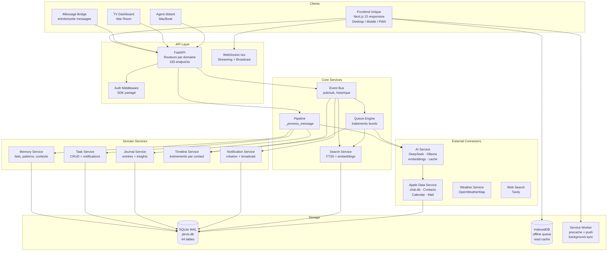
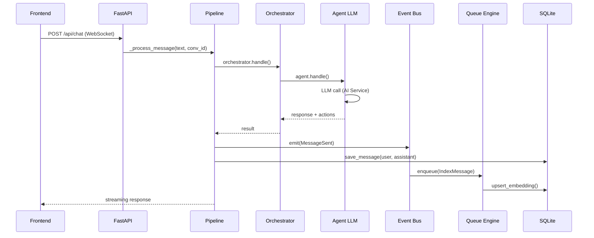
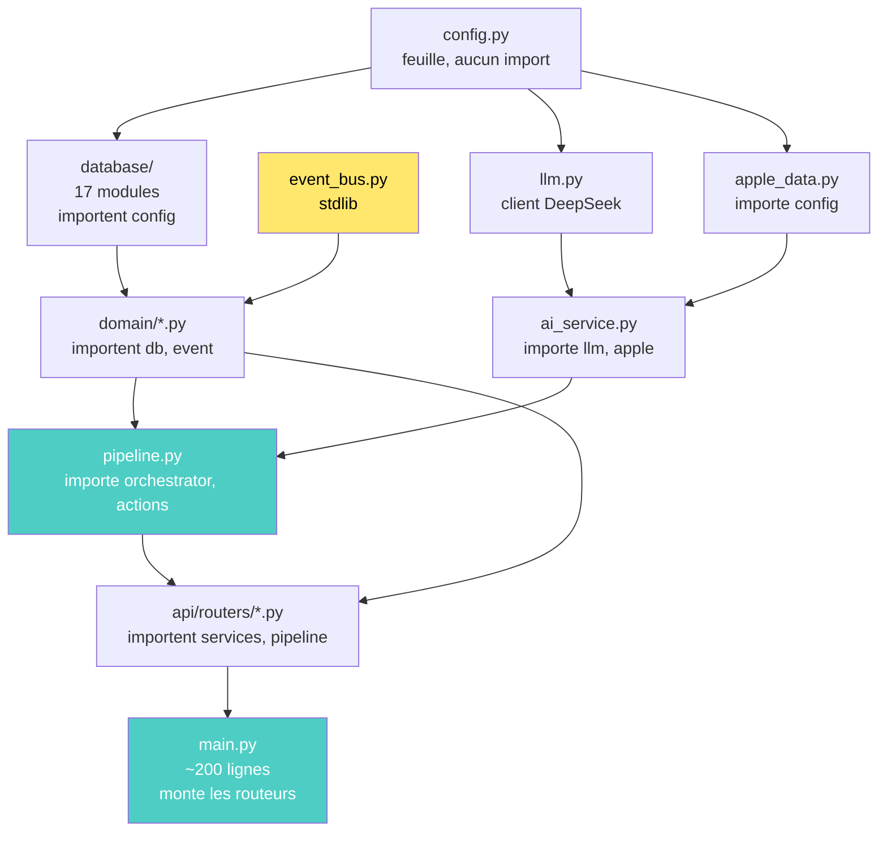

# 08 — Architecture Cible (Target Architecture)

**Date** : 11 juillet 2026
**Statut** : Cible après refactoring complet (Phases 1-6)

---

L'architecture cible représente l'organisation idéale de JARVIS après tous les refactorings planifiés. Elle est organisée en couches strictement séparées, communiquant via des interfaces explicites et un Event Bus central.

## Vue d'ensemble



## Couche 1 — Clients

| Client | Technologie | Responsabilité |
|---|---|---|
| Frontend Unique | Next.js 15, React 19, Tailwind v4 | Interface responsive Desktop/Mobile/PWA |
| iMessage Bridge | AppleScript (lecture chat.db + envoi) | Entrée/sortie iMessage |
| TV Dashboard | FastAPI + JS vanilla | Affichage War Room sur TV |
| Agent distant | Python + requests + Pillow | Capture écran MacBook → TTS |

## Couche 2 — API Layer

**Routeurs FastAPI par domaine** (12 routeurs, ~200 lignes dans `main.py`) :

```
api/
├── router_auth.py          ← /api/auth/*
├── router_people.py        ← /api/people/*
├── router_conversations.py ← /api/conversations/*
├── router_tasks.py         ← /api/tasks/*
├── router_location.py      ← /api/location/*, /api/places/*
├── router_devices.py       ← /api/devices/*
├── router_daemon.py        ← /api/audio-daemon/*, /api/control/*
├── router_devagent.py      ← /api/devagent/*
├── router_quality.py       ← /api/quality/*, /api/migrations/*
├── router_rituals.py       ← /api/rituals/*, /api/dnd/*
├── router_recordings.py    ← /api/recordings/*
├── router_misc.py          ← Status, stats, costs, export, search
├── ws_handler.py           ← WebSocket /ws
├── frontend.py             ← _setup_frontend, _is_mobile_device
└── middleware.py            ← security_middleware
```

## Couche 3 — Core Services

### Pipeline (`pipeline.py`)

Point d'entrée unique pour le traitement de message :
```
Input (WS texte, WS audio, REST) → _build_enriched_context → orchestrator.handle
→ agent.handle → _extract_action → execute_action → response + TTS
```

### Event Bus (`jarvis/event_bus.py`)

Tous les événements système transitent par le bus. Consommateurs :
- `broadcast_ws` (push WebSocket)
- `Queue Engine` (traitements lourds)
- `NotificationService` (création + diffusion)
- `SearchService` (indexation)

### Queue Engine (`queue_engine.py`)

File de traitement pour les opérations lourdes :
```
MessageImported → Résumé IA → Embeddings → Timeline → Mémoire → Notifications → Recherche
```

### Search Service (`search_service.py`)

Moteur de recherche unifié : FTS5 (SQLite) + embeddings (sentence-transformers).

## Couche 4 — Domain Services

Chaque service est propriétaire de ses données (Data Ownership — ADR-011).

| Service | Données possédées | Écriture | Lecture |
|---|---|---|---|
| Memory Service | episodes, facts, patterns, life_profile | ✅ | Tous |
| Task Service | tasks | ✅ | Tous |
| Journal Service | journal entries, insights | ✅ | Tous |
| Timeline Service | relationship_events, timeline | ✅ | Tous |
| Notification Service | notifications | ✅ | Tous |

## Couche 5 — External Connectors (Plugins)

Chaque connecteur externe implémente l'interface `Plugin` (ADR-015).

### Apple Data Service

**SEUL** point d'accès à `chat.db`, Contacts, Calendar, Mail. Tous les autres services passent par lui.

### AI Service

**SEUL** point d'accès aux LLM (DeepSeek, Ollama). Gère le cache, les embeddings, le routage entre modèles.

## Couche 6 — Storage

| Stockage | Technologie | Usage |
|---|---|---|
| SQLite (jarvis.db) | WAL mode | Données persistantes (44 tables) |
| IndexedDB | idb v8 | File d'écriture offline + cache lecture |
| Service Worker | Workbox | Precache app shell, push, background sync |

## Flux de données principal



## Dépendances (post-refactoring)



**Zéro dépendance circulaire. Zéro lazy import. Zéro god object.**
