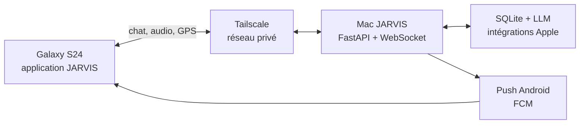

# JARVIS Android H24

Statut : phase A démarrée le 15 juillet 2026. Le prototype Android 0.1 est
compilé localement ; le pairage natif et les services H24 restent à développer.

## Objectif

Le Mac reste le cerveau, la mémoire SQLite et le point d'accès aux intégrations
Apple. Le Galaxy S24 devient l'interface personnelle permanente hors bureau :
conversation, voix, alertes, localisation, capture de contexte et actions rapides.

L'application finale ne doit pas être une simple WebView. Elle doit recevoir les
alertes en arrière-plan, survivre au redémarrage du téléphone et expliquer clairement
quand le Mac est hors ligne.

## Architecture cible

## Principes

- Une seule identité : JARVIS.
- Aucun port public ; Tailscale et HTTPS par défaut.
- Wake word détecté localement, sans flux micro permanent vers le Mac.
- Capteurs visibles et désactivables.
- Cache local chiffré et limité.
- Révocation immédiate du téléphone perdu.
- Fonctionnement dégradé explicite si le Mac est absent.
- Batterie traitée comme un budget.

## Avancement phase A

- module Gradle Android dans `android/` ;
- APK debug `fr.jarvis.companion` compilé et signé ;
- adresse Tailscale personnelle configurable ;
- session web et LockGate existants réutilisés ;
- permissions micro, GPS et fichiers reliées à Android ;
- interface chat/voix responsive pour le S24 ;
- reconnexion et gestion explicite du certificat autosigné ;
- build frontend, lint Android et démarrage émulateur validés.

## Priorités suivantes

### P0 — usage quotidien

- pairage du S24 par QR/code temporaire ;
- jeton d'appareil dans Android Keystore et biométrie ;
- chat streaming, appui pour parler et reprise de conversation ;
- notifications natives urgent/high application fermée ;
- briefing, tâches, agenda et mails importants ;
- révocation du téléphone depuis les sessions ;
- état réseau et dernière connexion au Mac.

### P1 — présence H24

- GPS adaptatif et geofencing en arrière-plan ;
- WorkManager pour la file hors ligne ;
- widget : parler, tâche, briefing et état JARVIS ;
- partage Android de texte, URL, photo et PDF ;
- mode voiture et audio Bluetooth ;
- diagnostic batterie Samsung et démarrage après reboot.

### P2 — JARVIS ambiant

- wake word local avec ForegroundService visible ;
- tuile Quick Settings « JARVIS écoute » ;
- conversation depuis l'écran verrouillé avec garde-fous ;
- adaptation GPS selon marche, immobilité ou voiture ;
- routines contextuelles départ, arrivée et retour tardif.

## Backend à ajouter

- table `mobile_devices` avec clé publique, token hashé et dernière activité ;
- pairage court, unique et expirant ;
- rotation/révocation de jeton lié à l'appareil ;
- authentification mobile pour REST et WebSocket ;
- adaptateur FCM séparé du Web Push existant ;
- identifiants idempotents pour les écritures hors ligne ;
- localisation par lot authentifiée par appareil.

## Disponibilité H24

L'APK ne peut pas compenser un Mac endormi. La mise en service exigera launchd,
supervisor, Tailscale au boot, absence de veille sur secteur, redémarrage après
coupure, sauvegardes vérifiées et état LLM/STT/TTS remonté au téléphone.

## Validation avant version quotidienne

- installation propre sur S24 ;
- pairage en moins de deux minutes ;
- chat et voix en Wi-Fi puis 4G/5G ;
- changement de réseau sans doublon ;
- push urgent reçu application fermée ;
- révocation immédiate ;
- reconnexion après reboot Mac et téléphone ;
- permissions refusées sans blocage global ;
- mesure batterie sur 24 heures avant wake word/GPS H24.
