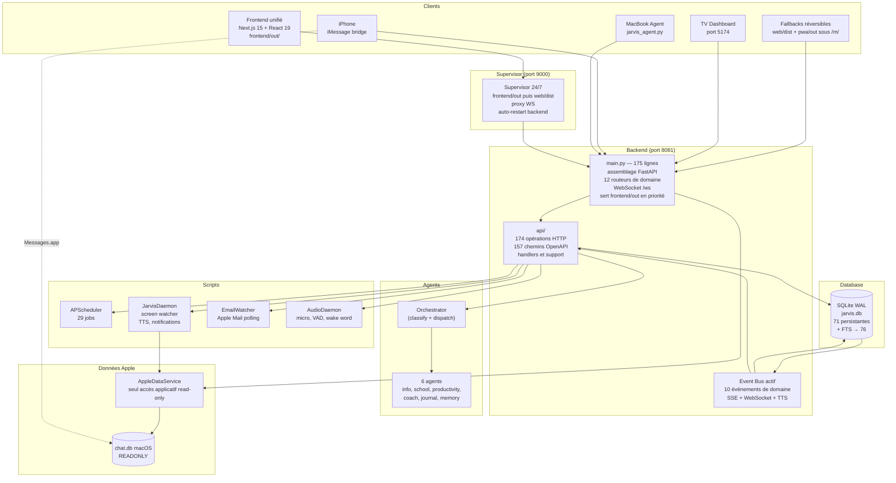
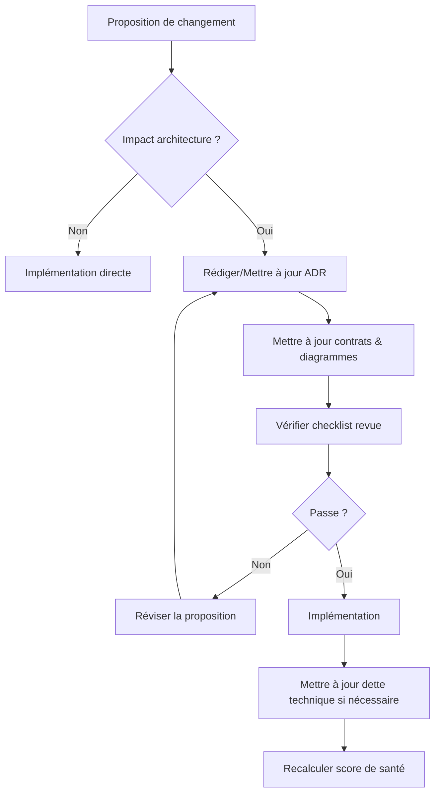

# Architecture — Source de vérité officielle de JARVIS API

**Date initiale** : 11 juillet 2026

**Dernière mise à jour** : 14 juillet 2026
**Périmètre** : 273 fichiers Python (56 261 lignes), 99 fichiers source frontend (18 770 lignes),
**70 tables SQLite persistantes** après `init_db()` (+ jusqu’à **5 objets FTS5** → **75** physiques ;
le dump `schema.sql` historique compte **44** tables applicatives —
voir [32_FRONTEND_DATABASE_SOURCE_OF_TRUTH.md](./32_FRONTEND_DATABASE_SOURCE_OF_TRUTH.md))
**État** : **Documentation officielle — toute modification du code doit rester cohérente avec ce dossier**

---

## RÈGLE ABSOLUE

> **Le dossier `Architecture/` est la source de vérité officielle du projet JARVIS.**
>
> Tout changement d'architecture DOIT obligatoirement mettre à jour :
> - les ADR concernés ;
> - les diagrammes Mermaid ;
> - le plan de migration si nécessaire ;
> - les contrats API si impactés ;
> - les règles de gouvernance.
>
> Le code doit TOUJOURS être cohérent avec cette documentation.
> Une PR modifiant l'architecture sans mettre à jour la documentation sera refusée.

---

## Structure du rapport

| Document | Contenu |
|---|---|
| [00_VISION.md](./00_VISION.md) | Vision long terme, principes non négociables |
| [01_CARTOGRAPHIE.md](./01_CARTOGRAPHIE.md) | Cartographie complète : modules, dépendances, flux de données |
| [02_ANALYSE_PROBLEMES.md](./02_ANALYSE_PROBLEMES.md) | 23 problèmes identifiés avec gravité, origine, conséquences |
| [03_AUDIT_TECHNIQUE.md](./03_AUDIT_TECHNIQUE.md) | Audit backend, frontend, DB, synchronisation, sécurité |
| [04_ADR.md](./04_ADR.md) | 10 Architecture Decision Records core |
| [05_PLAN_MIGRATION.md](./05_PLAN_MIGRATION.md) | Plan de migration en 6 phases, 15 jours |
| [06_PLAN_TESTS.md](./06_PLAN_TESTS.md) | Stratégie de tests, couverture actuelle, zones à améliorer |
| [07_FEUILLE_DE_ROUTE.md](./07_FEUILLE_DE_ROUTE.md) | Priorisation et roadmap technique |
| [08_ARCHITECTURE_CIBLE.md](./08_ARCHITECTURE_CIBLE.md) | Architecture cible post-refactoring (diagrammes Mermaid) |
| [09_DATA_OWNERSHIP.md](./09_DATA_OWNERSHIP.md) | Data Ownership — ADR-011, propriétaires uniques |
| [10_GOUVERNANCE_EVENTS.md](./10_GOUVERNANCE_EVENTS.md) | Gouvernance des événements — ADR-005-bis, catalogue |
| [11_QUEUE_ENGINE.md](./11_QUEUE_ENGINE.md) | Queue Engine — ADR-012, traitements lourds |
| [12_OBSERVABILITE.md](./12_OBSERVABILITE.md) | Observabilité — /health, /metrics, /ready, alertes |
| [13_PLUGINS.md](./13_PLUGINS.md) | Architecture de plugins — ADR-013, interface standard |
| [14_AI_SERVICE.md](./14_AI_SERVICE.md) | AI Service — ADR-014, point d'entrée LLM unique |
| [15_SAUVEGARDES.md](./15_SAUVEGARDES.md) | Stratégie de sauvegardes — ADR-015 |
| [16_CONTRATS_API.md](./16_CONTRATS_API.md) | Contrats API REST + WebSocket, versionnement |
| [17_DEFINITION_OF_DONE.md](./17_DEFINITION_OF_DONE.md) | Definition of Done — critères par phase |
| [18_GOUVERNANCE.md](./18_GOUVERNANCE.md) | Gouvernance — 12 règles d'architecture |
| [19_VALIDATION_FINALE.md](./19_VALIDATION_FINALE.md) | Score de maturité 7.60/10, risques, recommandations |
| [20_CONTRATS_INTERNES.md](./20_CONTRATS_INTERNES.md) | Contrats internes — interfaces entre services |
| [21_DEPENDENCY_RULES.md](./21_DEPENDENCY_RULES.md) | Règles de dépendances autorisées et interdites |
| [22_FITNESS_FUNCTIONS.md](./22_FITNESS_FUNCTIONS.md) | Architecture Fitness Functions — règles CI |
| [23_TECHNICAL_DEBT.md](./23_TECHNICAL_DEBT.md) | Stratégie de gestion de la dette technique |
| [24_GOUVERNANCE_ADR.md](./24_GOUVERNANCE_ADR.md) | Gouvernance du cycle de vie des ADR |
| [25_REVUE_ARCHITECTURE.md](./25_REVUE_ARCHITECTURE.md) | Checklist de revue d'architecture |
| [26_SCORE_SANTE.md](./26_SCORE_SANTE.md) | Score de santé — mesure qualité architecture |
| [27_RAPPORT_PRET_REFACTORING.md](./27_RAPPORT_PRET_REFACTORING.md) | Rapport final : prêt pour le refactoring |
| [28_VALIDATION_COHERENCE.md](./28_VALIDATION_COHERENCE.md) | Vérification de cohérence entre documentation et code |
| [29_JARVIS_ANDROID_H24.md](./29_JARVIS_ANDROID_H24.md) | Architecture du compagnon Android permanent |
| [30_PLAN_STABILISATION_AUDIO.md](./30_PLAN_STABILISATION_AUDIO.md) | Phases de stabilisation audio après la PR #17 |
| [32_FRONTEND_DATABASE_SOURCE_OF_TRUTH.md](./32_FRONTEND_DATABASE_SOURCE_OF_TRUTH.md) | **Source de vérité** frontends + comptages SQLite (audit 15/07/2026) |
| [adr/](./adr/) | ADR individuels — dont ADR-019 (priorité frontend supervisor) |
| [diagrams/](./diagrams/) | Diagrammes Mermaid source |
| [audit/](./audit/) | Rapports d'audit détaillés par domaine |

---

## Résumé exécutif

### Chiffres clés

```
┌─────────────────────────────────────────────────────────┐
│                     JARVIS API                           │
├─────────────────────────────────────────────────────────┤
│  Backend           │ 273 fichiers Python, 56 261 lignes  │
│  Frontend unifié   │ 14 fichiers, 1 016 lignes           │
│  Vues desktop      │ 38 fichiers, 12 940 lignes          │
│  Vues mobiles      │ 32 fichiers, 4 641 lignes           │
│  SDK auth partagé  │ 4 fichiers, 373 lignes              │
│  Base de données   │ 71 persistantes (+FTS→76), mode WAL │
│  Routes API        │ 174 opérations HTTP, 157 chemins    │
│  WebSocket         │ 1 endpoint, handler dédié           │
│  Agents LLM        │ 7 agents + orchestrateur            │
│  Jobs schedulés    │ 29 (APScheduler)                    │
│  Démons            │ 5 (screen, audio, email, imessage)  │
│  Tests backend     │ 565 pytest, 66 fichiers             │
│  Tests frontend    │ 28 Vitest + 3 Playwright            │
├─────────────────────────────────────────────────────────┤
│  Couche API        │ main.py 175 lignes, 12 routeurs     │
│  Database          │ façade 236 lignes, 25 modules       │
│  Event bus         │ 10 événements, 3 consommateurs      │
│  Frontend          │ 1 cible canonique + 2 fallbacks     │
│  Partage           │ auth, client API, types et vues     │
│                    │ 0 lecteur direct hors AppleDataService│
│                    │ 1 conversion Apple canonique         │
│  Problèmes         │ 4 critiques, 6 majeurs,             │
│                    │ 8 modérés, 5 mineurs                 │
└─────────────────────────────────────────────────────────┘
```

### Architecture actuelle



### Top 5 des problèmes identifiés — état au 14 juillet 2026

| # | Problème | Sévérité initiale | Impact | État |
|---|---|---|---|---|
| 1 | PWA sans écran de verrouillage | CRITIQUE | Données exposées si téléphone déverrouillé | ✅ Résolu — Phase 6 (`jarvis_auth/`) |
| 2 | 3 curseurs ROWID indépendants sur chat.db | CRITIQUE | Messages traités 2-3 fois | ✅ Résolu — Phase 1 |
| 3 | Race condition sur le set WebSocket | CRITIQUE | Crash potentiel (`Set changed size during iteration`) | ✅ Résolu — Phase 1 |
| 4 | SQLite sans `busy_timeout` | CRITIQUE | Écritures silencieusement perdues | ✅ Résolu — Phase 1 |
| 5 | main.py : 7 197 lignes, 40+ responsabilités (état historique) | MAJEURE | Impossible à tester, toute modification risquée | ✅ Résolu — Phase 4 (`main.py` 175 lignes, 12 routeurs) |

### Plan de migration — 6 phases, 15 jours

```
Semaine 1 │ Phase 1: Quick wins P0 (1j) │ Phase 2: Database modulaire (1j)
Semaine 2 │ Phase 3: Event bus actif (2j, fait) │ Phase 4: Routeurs FastAPI (fait)
Semaine 3 │ Phase 5: Apple Data Service (fait) │ Phase 6: Frontend unifié (fait)
```

Chaque phase est **indépendante**, **réversible**, **testée**, et **sans interruption de service**.

---

## Comment lire ce rapport

**Audit & Diagnostic (01-03)** : Comprendre l'état actuel
- [01_CARTOGRAPHIE.md](./01_CARTOGRAPHIE.md) — structure, dépendances, flux
- [02_ANALYSE_PROBLEMES.md](./02_ANALYSE_PROBLEMES.md) — 23 problèmes classés
- [03_AUDIT_TECHNIQUE.md](./03_AUDIT_TECHNIQUE.md) — audit backend, frontend, DB, sécurité

**Décisions (04, 09-15 + adr/)** : 19 ADR documentés
- [04_ADR.md](./04_ADR.md) — 10 ADR core (résumé)
- [09_DATA_OWNERSHIP.md](./09_DATA_OWNERSHIP.md) — ADR-011 propriétaires de données
- [10_GOUVERNANCE_EVENTS.md](./10_GOUVERNANCE_EVENTS.md) — ADR-005-bis contrats événements
- [11_QUEUE_ENGINE.md](./11_QUEUE_ENGINE.md) — ADR-012 file de traitements
- [12_OBSERVABILITE.md](./12_OBSERVABILITE.md) — ADR implicite monitoring
- [13_PLUGINS.md](./13_PLUGINS.md) — ADR-013 connecteurs externes
- [14_AI_SERVICE.md](./14_AI_SERVICE.md) — ADR-014 point d'entrée LLM unique
- [15_SAUVEGARDES.md](./15_SAUVEGARDES.md) — ADR-015 backup & restore
- [adr/ADR-016](./adr/ADR-016-applescript-integration-apple.md) — AppleScript comme unique intégration Apple
- [adr/ADR-017](./adr/ADR-017-sqlite-base-unique.md) — SQLite comme base de données unique
- [adr/ADR-018](./adr/ADR-018-dual-llm-router.md) — Architecture dual-LLM (local + cloud)

**Planification (05-07)** : Exécution
- [05_PLAN_MIGRATION.md](./05_PLAN_MIGRATION.md) — 6 phases, 15 jours
- [06_PLAN_TESTS.md](./06_PLAN_TESTS.md) — stratégie de tests
- [07_FEUILLE_DE_ROUTE.md](./07_FEUILLE_DE_ROUTE.md) — Q3/Q4 2026 → 2027

**Architecture cible & Gouvernance (08, 16-19)** : Vision long terme
- [08_ARCHITECTURE_CIBLE.md](./08_ARCHITECTURE_CIBLE.md) — architecture finale visée
- [16_CONTRATS_API.md](./16_CONTRATS_API.md) — versionnement, pagination, erreurs
- [17_DEFINITION_OF_DONE.md](./17_DEFINITION_OF_DONE.md) — critères de complétion
- [18_GOUVERNANCE.md](./18_GOUVERNANCE.md) — 12 règles d'architecture
- [19_VALIDATION_FINALE.md](./19_VALIDATION_FINALE.md) — score, risques, recommandations

---

## Statut

- [x] 00_VISION.md — vision long terme et principes non négociables
- [x] Audit complet — 01-03 (cartographie, 23 problèmes, audit technique)
- [x] 19 ADR (04, 09-15, 24, adr/ADR-016—018)
- [x] Architecture cible documentée (08)
- [x] Planification (05-07) : migration, tests, roadmap
- [x] Contrats (16, 20) : API REST/WebSocket + interfaces internes
- [x] Gouvernance (00, 17-19, 21-27) : 12 règles, DoD, dépendances, fitness, dette, score, revue
- [x] Score de santé : 7.20/10 après Phase 6 ; la cible 8.5 exige encore observabilité, stabilité 24 h et couverture mesurée
- [x] Rapport final — prêt pour le refactoring (27)
- [ ] Validation par l'utilisateur
- [x] Phases 1 à 6 implémentées et validées sur `main` le 14/07/2026

**Dossier Architecture/ : 35 fichiers Markdown + 3 sous-répertoires — source de vérité officielle du projet**

**Prochaine étape** : valider sur appareils physiques, aligner éventuellement le supervisor (9000) sur `frontend/out`, puis retirer progressivement les fallbacks historiques.

---

## Processus de modification de l'architecture



## Convention de nommage

- ADR : `adr/ADR-XXX-titre-court.md` (numérotation séquentielle à 3 chiffres)
- Diagrammes : Mermaid inline dans les documents markdown
- Dates : format ISO 8601 (`YYYY-MM-DD`)
- Documents d'architecture : numérotés `NN_NOM.md` (00-30)

## Responsabilité

Ce dossier est maintenu par le développeur principal.
Tout agent IA (Cursor, Claude, DevAgent) qui modifie l'architecture doit proposer les mises à jour documentaires correspondantes dans le même commit.
