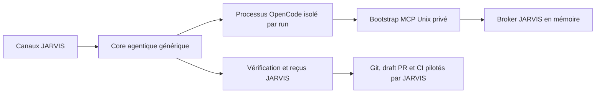

# Modèle de menace

## Actifs

Les actifs protégés sont les demandes utilisateur, worktrees, secrets JARVIS,
tokens d'approbation, base par profil, artefacts vérifiés et contrôle Git/CI.
OpenCode, le modèle, les sorties d'outils, le dépôt traité et ses fichiers de
configuration sont considérés non fiables.

## Frontières

Le serveur fournisseur écoute uniquement sur loopback avec Basic Auth
éphémère. Chaque run possède HOME/XDG, port, auth, configuration et broker
distincts. Les fichiers projet OpenCode et plugins workspace sont neutralisés
avec le mode pur et `OPENCODE_DISABLE_PROJECT_CONFIG=true`.

## Menaces et contrôles

| Menace | Contrôle |
|---|---|
| Traversal, symlink, sortie du worktree | chemins résolus, inode vérifié, refus des liens et chemins sensibles |
| Config/plugin projet hostile | `serve --pure`, config projet désactivée, agents durcis |
| Secret dans argv/log/env | auth serveur en fichier privé ; bearer MCP remis par bootstrap one-shot, jamais journalisé |
| Appel MCP forgé ou cross-run | capacité run/profil/workspace/TTL et reçu d'approbation exact outil+arguments |
| Double effet après crash | journal `pending` fsync avant effet, replay terminé, ambiguïté bloquée |
| Faux succès du modèle | verdict JARVIS déterministe et reçus de tests/effets |
| Déni mémoire | limites SSE, événements, queue, artefacts, tokens, contexte et durée |
| Processus orphelin | scan borné, preuve de propriété PID/commande puis arrêt ciblé |

Sur Windows, le bridge MCP privé échoue fermé avec
`unsupported_secure_peer_transport` tant qu'une authentification de peer
équivalente aux sockets Unix n'est pas disponible. Aucun fallback TCP affaibli
n'est utilisé.
